# ArduPilot Firmware Verification Process - Mermaid Diagram

## Overview
This diagram shows the complete firmware verification process in ArduPilot's bootloader, including CRC validation and signature verification.

## Main Flow Diagram


## Memory Layout and CRC Calculation


## Error Codes and Results

```mermaid
graph TD
    A[check_fw_result_t] --> B[CHECK_FW_OK]
    A --> C[FAIL_REASON_NO_APP_SIG]
    A --> D[FAIL_REASON_BAD_LENGTH_APP]
    A --> E[FAIL_REASON_BAD_BOARD_ID]
    A --> F[FAIL_REASON_BAD_LENGTH_DESCRIPTOR]
    A --> G[FAIL_REASON_BAD_CRC]
    A --> H[FAIL_REASON_BAD_FIRMWARE_SIGNATURE]
    A --> I[FAIL_REASON_VERIFICATION]
    
    B --> J[✅ Boot Application]
    C --> K[❌ No descriptor found]
    D --> L[❌ Image too large]
    E --> M[❌ Wrong board]
    F --> N[❌ Bad descriptor]
    G --> O[❌ CRC mismatch]
    H --> P[❌ Bad signature format]
    I --> Q[❌ Signature verification failed]
    
    classDef success fill:#90EE90
    classDef error fill:#FFB6C1
    
    class B,J success
    class C,D,E,F,G,H,I,K,L,M,N,O,P,Q error
```



## Key Functions and Their Roles

| Function | Purpose |
|----------|---------|
| `check_good_firmware()` | Main entry point - decides signed vs unsigned path |
| `check_good_firmware_signed()` | Validates signed firmware with CRC and signature |
| `check_good_firmware_unsigned()` | Validates unsigned firmware with CRC only |
| `check_firmware_signature()` | Verifies cryptographic signature using public keys |
| `all_zero_public_keys()` | Checks if unsigned firmware is allowed |
| `crc32_small()` | Calculates CRC32 checksum for firmware regions |

## Security Analysis: Zero Public Keys Behavior

### Why Zero Keys Allow Boot

The bootloader allows firmware to boot when all public keys are zero due to a **development vs production build strategy**:

#### **Development/Debug Builds:**
- No cryptographic keys embedded in bootloader
- All public key slots contain zeros
- Enables rapid development without signing infrastructure
- Falls back to CRC-only validation

#### **Production Builds:**
- Real public keys embedded during manufacturing
- Strict signature verification required
- No fallback to unsigned verification

### **Critical Security Considerations:**

⚠️ **SECURITY RISK**: The zero-key fallback creates a potential attack vector:

1. **Attack Scenario**: If an attacker can zero out public keys in flash memory
2. **Fallback Triggered**: Bootloader detects "all zero keys"
3. **Weakened Security**: Falls back to CRC-only verification
4. **Malicious Firmware**: Attacker can load firmware that passes CRC but lacks valid signature

### **When Zero Keys Occur:**
- **Intentional**: Development builds without embedded keys
- **Manufacturing**: New boards before key programming
- **Corruption**: Flash memory corruption affecting key storage area
- **Attack**: Deliberate key erasure by malicious actor

### **Mitigation Strategies:**
- **Write-Protect Keys**: Use flash protection for public key storage area
- **Key Validation**: Additional integrity checks on public key area
- **Secure Boot**: Hardware-based root of trust
- **Production Flags**: Build-time flags to disable fallback behavior

### **OEM Security Responsibilities:**

🔒 **Critical OEM Protection Strategy**: The zero public key vulnerability is **significantly mitigated** when OEMs implement proper security measures:

#### **Bootloader Protection:**
- **OEM-Controlled Updates**: Only OEM can update/modify the bootloader itself
- **Protected Flash Sections**: Bootloader code and public keys in write-protected flash regions
- **Secure Update Channels**: Bootloader updates only through authenticated OEM processes

#### **Physical Security:**
- **Abstract Upgrade Ports**: Hide or disable direct bootloader access ports in production
- **Secure Connectors**: Programming interfaces accessible only with special tools/procedures  
- **Tamper Detection**: Hardware protection against unauthorized access attempts

#### **Build Configuration Security:**
```cpp
// Production builds should have:
#define AP_SIGNED_FIRMWARE 1        // ← Set at build time
// Public keys embedded in protected flash section
// Zero-key fallback disabled in production builds
```

#### **Why This Approach Works:**
1. **Attacker Cannot Modify Bootloader**: Without OEM access, bootloader code is immutable
2. **Public Keys Protected**: Keys stored in bootloader-protected flash regions
3. **Physical Access Required**: Direct hardware modification needed to compromise system
4. **OEM Controls Security**: Only authorized OEM processes can change security configuration

**Result**: If bootloader cannot be modified by attackers, the public keys remain intact and zero-key fallback never occurs, maintaining full signature verification security.

## Notes
- The bootloader splits firmware into two regions (flash1 and flash2) for CRC calculation
- Public keys are stored in a special section (`.apsec_data`) 
- Signature verification uses the Monocypher cryptographic library
- The system supports fallback from signed to unsigned verification and vice versa
- Board ID matching prevents loading firmware built for different hardware
- **⚠️ Zero public keys represent a significant security consideration in production systems**
